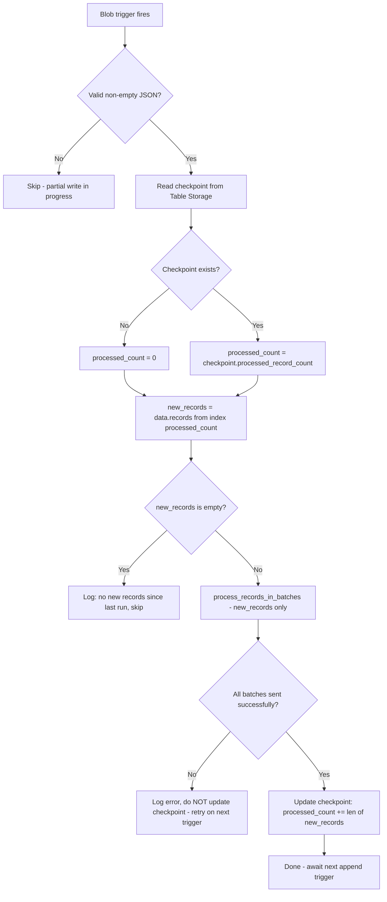

# VNET Flow Logs — Checkpoint Implementation Plan

## Problem Statement

Azure Network Watcher writes VNET Flow Log files using an **append-blob pattern**:

1. At the start of each hour, Azure creates a new blob at a path like:
   `insights-logs-flowlogflowevent/resourceId=.../y=2024/m=01/d=15/h=10/m=00/PT1H.json`
2. Throughout that hour, Azure **appends new `records[]` entries** to the same blob — the file is not replaced, it grows.
3. Each append triggers the blob trigger in the Azure Function, causing `main()` to fire.
4. Each invocation reads the **entire blob** via `blob.read()` and processes **all records** from the beginning.
5. Result: if Azure appends N times during the hour, record #1 is processed N times, record #2 is processed N-1 times, etc. — **severe duplication**.

The existing code already handles the partial JSON case (mid-write state) gracefully, but once the JSON is valid, it re-processes everything from scratch.

---

## Proposed Solution: Record-Count Checkpoint via Azure Table Storage

### Why Azure Table Storage?

The dedicated internal storage account (`internalStorageAccountName` / `AzureWebJobsStorage`) already has Blob, Queue, File, and **Table** private endpoints provisioned in the ARM template. Azure Table Storage is ideal because:

- **Atomic row upserts** — no locking needed
- **Key-value semantics** — blob path → checkpoint state
- **No extra infrastructure** — already provisioned
- **Lightweight SDK** — `azure-data-tables` is a small addition

### Why Record Count, Not Byte Offset?

- The blob trigger gives us `blob.length` (total bytes), but **not** a byte range read — `blob.read()` always returns the full content.
- We must parse the JSON anyway to know where new records start.
- **Record count** (number of top-level `records[]` items already processed) is the natural, stable cursor — it maps directly to `data['records'][N:]` slicing.
- Byte offset would require partial-read logic that the Azure Functions blob binding does not natively support.

---

## Flow Diagram



---

## Checkpoint Schema

| Field | Type | Description |
|---|---|---|
| `PartitionKey` | `str` | Stable hash of the blob path prefix (everything before the filename) |
| `RowKey` | `str` | The blob filename, e.g. `PT1H.json` |
| `processed_record_count` | `int` | Number of top-level `records[]` entries already sent |
| `blob_size_at_last_run` | `int` | `blob.length` at last successful run (sanity check) |
| `last_updated` | `str` | ISO timestamp of last update (for future cleanup tooling) |

**Table name:** `vnetflowcheckpoints` (configurable via `CHECKPOINT_TABLE_NAME` env var)

---

## Files to Create / Modify

### 1. `vnet-flow-logs/requirements.txt` — Add dependency

```
azure-data-tables>=12.5.0
```

### 2. `vnet-flow-logs/cortex_function/checkpoint.py` — New module

Encapsulate all checkpoint logic in a dedicated module with a `CheckpointManager` class:

```python
class CheckpointManager:
    TABLE_NAME_DEFAULT = "vnetflowcheckpoints"

    def __init__(self, connection_string: str, table_name: str = TABLE_NAME_DEFAULT):
        # Initialize TableServiceClient and ensure table exists

    def get(self, blob_name: str) -> int:
        """
        Returns number of already-processed top-level records.
        Returns 0 if no checkpoint exists.
        """

    def update(self, blob_name: str, processed_count: int, blob_size: int) -> None:
        """
        Upserts the checkpoint row with the new processed_count.
        Conditionally triggers passive cleanup based on the current hour modulo
        CLEANUP_INTERVAL_HOURS (default: 6). Cleanup is skipped on most invocations,
        keeping the per-invocation overhead minimal.
        """

    def maybe_cleanup_stale(self, retention_days: int) -> None:
        """
        Called from update() when current_hour % CLEANUP_INTERVAL_HOURS == 0.
        Scans all partitions for rows where last_updated is older than retention_days
        and batch-deletes them (up to 100 rows per partition per transaction).
        404 responses on already-deleted rows are swallowed safely.
        """

    def _make_keys(self, blob_name: str) -> tuple[str, str]:
        """
        Derives (PartitionKey, RowKey) from blob_name.
        PartitionKey = sha256 of the path prefix (everything before last '/')
        RowKey       = the filename component (e.g. 'PT1H.json')
        """
```

**Key derivation example:**
- `blob_name` = `insights-logs-flowlogflowevent/resourceId=.../y=2024/m=01/d=15/h=10/m=00/PT1H.json`
- `PartitionKey` = `sha256("insights-logs-flowlogflowevent/resourceId=.../y=2024/m=01/d=15/h=10/m=00")`
- `RowKey` = `"PT1H.json"`

### 3. `vnet-flow-logs/cortex_function/__init__.py` — Modify `main()`

**New configuration constants:**
```python
CHECKPOINT_CONNECTION = os.environ.get('CHECKPOINT_CONNECTION')
CHECKPOINT_TABLE_NAME = os.environ.get('CHECKPOINT_TABLE_NAME', 'vnetflowcheckpoints')
CHECKPOINT_RETENTION_DAYS = int(os.environ.get('CHECKPOINT_RETENTION_DAYS', 2))
CHECKPOINT_CLEANUP_INTERVAL_HOURS = int(os.environ.get('CHECKPOINT_CLEANUP_INTERVAL_HOURS', 6))
```

**Updated `main()` logic:**
```python
def main(blob: func.InputStream):
    # ... existing env checks (endpoint, token) ...
    # ... existing empty/partial JSON checks ...

    log_lines = json.loads(content)
    all_records = log_lines.get('records', [])

    if not all_records:
        logging.warning('empty blob, no logs')
        return

    # --- Checkpoint logic ---
    already_processed = 0
    checkpoint_mgr = None

    if CHECKPOINT_CONNECTION:
        checkpoint_mgr = CheckpointManager(CHECKPOINT_CONNECTION, CHECKPOINT_TABLE_NAME)
        try:
            already_processed = checkpoint_mgr.get(blob.name)
        except Exception as e:
            logging.error(f'Failed to read checkpoint, processing all records: {e}')
            already_processed = 0

        # Guard against blob shrink / re-creation
        if already_processed > len(all_records):
            logging.warning(
                f'Checkpoint ({already_processed}) exceeds total records ({len(all_records)}). '
                f'Resetting checkpoint to 0.'
            )
            already_processed = 0
    else:
        logging.warning('CHECKPOINT_CONNECTION not set; processing all records without checkpoint.')

    new_records = all_records[already_processed:]

    if not new_records:
        logging.info(f'No new records since last checkpoint ({already_processed} already processed). Skipping.')
        return

    logging.info(f'Processing {len(new_records)} new records (skipping first {already_processed})')

    # Process only new records — pass as a dict to reuse existing function signature
    process_records_in_batches({'records': new_records})

    # Update checkpoint only after successful processing
    if checkpoint_mgr:
        try:
            checkpoint_mgr.update(
                blob.name,
                already_processed + len(new_records),
                blob.length
            )
        except Exception as e:
            logging.error(f'Failed to update checkpoint: {e}')
```

**`process_records_in_batches()` — no structural change needed.** It already accepts a `data` dict with a `records` key, so passing the sliced subset is transparent.

### 4. `vnet-flow-logs/arm_template/private_storage.json` — Add app settings

Add two new entries to the `appSettings` array of the `Microsoft.Web/sites` resource:

```json
{
    "name": "CHECKPOINT_CONNECTION",
    "value": "[concat('DefaultEndpointsProtocol=https;AccountName=',variables('internalStorageAccountName'),';AccountKey=',listkeys(resourceId('Microsoft.Storage/storageAccounts', variables('internalStorageAccountName')), '2021-04-01').keys[0].value,';EndpointSuffix=',environment().suffixes.storage)]"
},
{
    "name": "CHECKPOINT_TABLE_NAME",
    "value": "vnetflowcheckpoints"
}
```

Note: `CHECKPOINT_CONNECTION` points to the **same** internal storage account as `AzureWebJobsStorage`. Using a separate named variable keeps checkpoint logic decoupled from the Azure Functions runtime storage and makes it easy to point to a different account in the future.

`CHECKPOINT_RETENTION_DAYS` and `CHECKPOINT_CLEANUP_INTERVAL_HOURS` are optional and use their defaults (`2` and `6` respectively) if omitted from the ARM template — they can be added as explicit app settings if operators need to tune them.

### 5. `vnet-flow-logs/tests/test_cortex_function.py` — New test classes

#### `TestCheckpointManager` (unit tests for `checkpoint.py`)

| Test | Description |
|---|---|
| `test_get_returns_zero_for_missing_key` | No row in table → returns 0 |
| `test_get_returns_stored_count` | Row exists → returns `processed_record_count` |
| `test_update_creates_row` | Upsert creates new row with correct fields including `last_updated` |
| `test_update_overwrites_existing` | Upsert updates existing row |
| `test_key_derivation_is_stable` | Same blob name always produces same PartitionKey/RowKey |
| `test_key_derivation_different_blobs` | Different blob names produce different keys |
| `test_cleanup_triggered_on_matching_hour` | When `current_hour % CLEANUP_INTERVAL_HOURS == 0`, `maybe_cleanup_stale()` is called |
| `test_cleanup_not_triggered_on_non_matching_hour` | When `current_hour % CLEANUP_INTERVAL_HOURS != 0`, `maybe_cleanup_stale()` is not called |
| `test_cleanup_deletes_stale_rows` | Rows with `last_updated` older than `retention_days` are batch-deleted |
| `test_cleanup_preserves_fresh_rows` | Rows within the retention window are not deleted |
| `test_cleanup_swallows_404_on_already_deleted_row` | 404 during batch delete does not raise |

#### `TestCheckpointBehavior` (integration tests for `main()`)

| Test | Description |
|---|---|
| `test_no_checkpoint_processes_all_records` | No checkpoint → all records processed, checkpoint written |
| `test_checkpoint_skips_already_processed` | Checkpoint at N → only `records[N:]` processed |
| `test_checkpoint_updated_after_success` | After processing, checkpoint count = old + new |
| `test_checkpoint_not_updated_on_send_failure` | HTTP failure → checkpoint not updated |
| `test_no_new_records_skips_processing` | Checkpoint == total records → no HTTP calls made |
| `test_checkpoint_reset_on_blob_shrink` | Checkpoint > total records → reset to 0, process all |
| `test_checkpoint_storage_unavailable_on_get` | Table Storage error on `get()` → falls back to 0, processes all |
| `test_checkpoint_storage_unavailable_on_update` | Table Storage error on `update()` → logs error, does not raise |
| `test_no_checkpoint_connection_env_var` | `CHECKPOINT_CONNECTION` not set → processes all records, logs warning |

---

## Checkpoint Update Strategy (Atomicity)

- Checkpoint is written **only after all batches for the new records are sent successfully**.
- If any batch fails (after retries), the checkpoint is **not updated** — the next trigger will re-process from the last good checkpoint. This may cause some re-sends of the current trigger's new records, but **never re-sends already-checkpointed records**.
- This is an **at-least-once** delivery guarantee, consistent with the existing retry logic.

---

## Error Handling Edge Cases

| Scenario | Behavior |
|---|---|
| Table Storage unreachable on `get()` | Log error, fall back to `processed_count = 0` (safe: may re-send, but won't skip) |
| Table Storage unreachable on `update()` | Log error, do not raise — next trigger will re-process new records only |
| Blob shrinks (Azure bug / re-creation) | `all_records` length < `already_processed` → reset checkpoint to 0, log warning |
| Concurrent triggers for same blob | Table Storage upsert is last-writer-wins; worst case: one extra re-send of the overlap |
| `CHECKPOINT_CONNECTION` not configured | Log warning, process all records (backward-compatible degraded mode) |

---

## Checkpoint Cleanup Strategy

Azure keeps flow log blobs for the configured retention period. Checkpoints for finalized blobs become stale over time. Azure Table Storage has **no native row-level TTL**, so cleanup is implemented passively inside `CheckpointManager`.

**Approach: time-modulo passive cleanup**

- Every checkpoint row stores a `last_updated` ISO timestamp.
- Inside `update()`, after the upsert, the current UTC hour is checked: if `datetime.utcnow().hour % CHECKPOINT_CLEANUP_INTERVAL_HOURS == 0`, `maybe_cleanup_stale()` is called.
- `maybe_cleanup_stale()` queries the table for all rows where `last_updated` is older than `CHECKPOINT_RETENTION_DAYS` days and batch-deletes them (up to 100 rows per transaction, which is the Table Storage batch limit).
- 404 responses on already-deleted rows (from concurrent invocations in the same cleanup hour) are swallowed safely — batch deletes are idempotent.
- This means cleanup runs approximately once every `CHECKPOINT_CLEANUP_INTERVAL_HOURS` hours (default: 6), not on every invocation, keeping per-invocation overhead minimal.

**Configuration:**

| Env var | Default | Description |
|---|---|---|
| `CHECKPOINT_RETENTION_DAYS` | `2` | Rows older than this are deleted. Flow log blobs finalize within 1 hour, so 2 days is very conservative. |
| `CHECKPOINT_CLEANUP_INTERVAL_HOURS` | `6` | Cleanup runs when `current_hour % interval == 0` (i.e., at hours 0, 6, 12, 18 UTC by default). |

---

## Summary of Changes

| File | Change Type | Description |
|---|---|---|
| `vnet-flow-logs/requirements.txt` | Modify | Add `azure-data-tables>=12.5.0` |
| `vnet-flow-logs/cortex_function/checkpoint.py` | Create | New `CheckpointManager` class |
| `vnet-flow-logs/cortex_function/__init__.py` | Modify | Add checkpoint read/write logic to `main()`, add new env var constants |
| `vnet-flow-logs/arm_template/private_storage.json` | Modify | Add `CHECKPOINT_CONNECTION` and `CHECKPOINT_TABLE_NAME` app settings |
| `vnet-flow-logs/tests/test_cortex_function.py` | Modify | Add `TestCheckpointManager` and `TestCheckpointBehavior` test classes |
